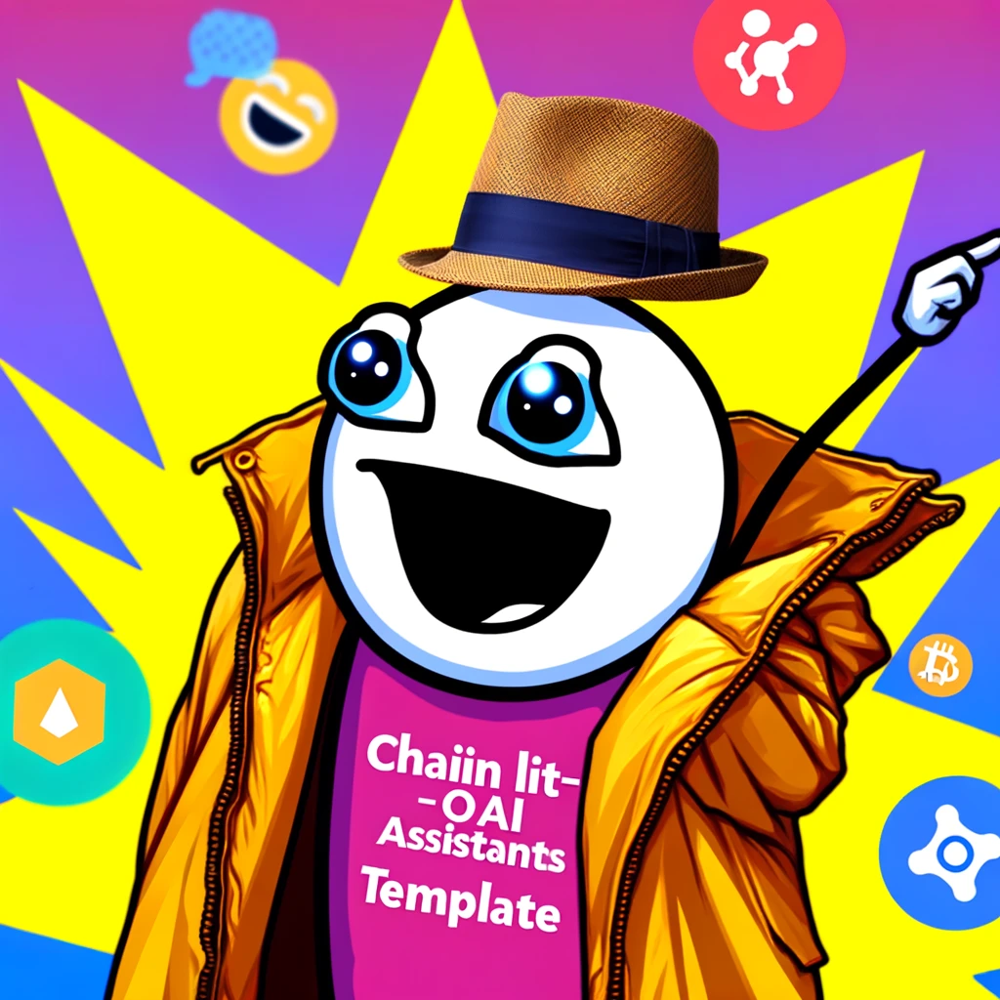

# Chainlit-OAI-Assistants Template (COAT): Your Starter Kit for Chainlit and OpenAI's Assistants API

Welcome to Chainlit-OAI-Assistants Template, a robust starting point for deploying applications using Chainlit and OpenAI's Assistants API. This repository is a public version of our current production monorepo, deployed at https://AIFGE.xyz, and we're releasing it publicly to give back to the Chainlit community. 

## What's Inside?

This repository is a demonstration of our recent work and serves as a launchpad for your projects. It's equipped with:

- OpenAI's Assistants API: We've found it to be an excellent tool for prototyping RAG applications. We currently handle file-retrieval tools along with annotations, but code interpreter and functions are not yet supported. 
- Deployment to Google Cloud Run: We've integrated Terraform for infrastructure management, with state stored in a bucket. Cloudbuild manages our Docker image, which we deploy to staging and production instances.
- Google Auth: Our app uses Google Auth for user authentication. You'll need to set this up yourself.
- Discord webhooks: We've added Discord webhooks for user login events. Chainlit now supports Discord bots as well, so expect more from us in the future. 
- Mailchimp integration: We've integrated a callback to Mailchimp to add users to our mailing list.

## Directory Structure

- `/infra`: Holds the Terraform config files and batch scripts.
- `/literal`: A simple wrapper to help us clean up our dev instances when we need to purge.
- `/openai-assistant`: Our current implementation of the OpenAI Assistant API. 

## Getting Started

To get started with Chainlit-Template, clone this repository. Install the project using poetry, and then run `chainlit run app.py` from the openai-assistant directory. 

Check the infra/readme to see how we setup our cloud run deployments. 

## Contributing

We welcome contributions! Submit an issue and related PR and we'll take a look! You can find us in the Chainlit Discord if you need anything else. 

## Changelog

To see what has changed in recent versions of COAT, see the `CHANGELOG.md` file.

## License

COAT is licensed under the terms of the MIT license. See the `LICENSE.md` file for the full license text.

## Contact

If you have any questions, issues, or just want to contribute, feel free to open an issue or a pull request. We're always happy to help and learn from you!